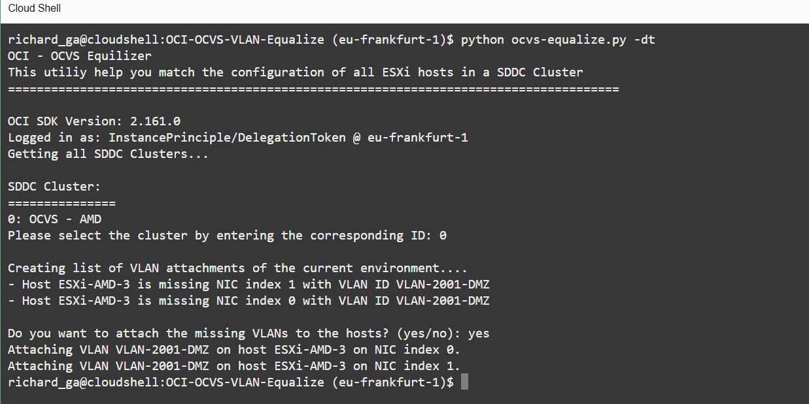

# OCI-OCVS-VLAN-Equalize
This script will equalized VLAN settings on ESXi Hosts part of an OCVS environment.

## how to use
Easiest is to run this script from Cloud Shell.
1. in cloud shell clone this script
```git clone https://github.com/AnykeyNL/OCI-OCVS-VLAN-Equalize.git```
2. go into the directory of the script
```cd OCI-OCVS-VLAN-Equalize```
3. Run the script with the -dt parameter (for cloud shell authentication)
```python ocvs-equalize.py -dt```
4. Select the OCVS environment you want to equalize and confirm any changes


## Usage
```
usage: ocvs-equalize.py [-h] [-cp CONFIG_PROFILE] [-ip] [-dt] [-log [LOG_FILE]]

optional arguments:
  -h, --help          show this help message and exit
  -cp CONFIG_PROFILE  Config Profile inside the config file
  -ip                 Use Instance Principals for Authentication
  -dt                 Use Delegation Token for Authentication
  -log [LOG_FILE]     Output also to logfile. If logfile not specified, will log to log.txt
```

## Example


